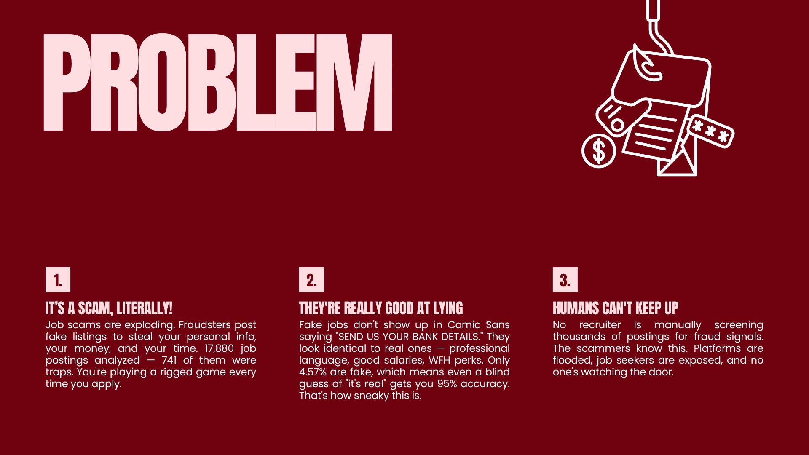
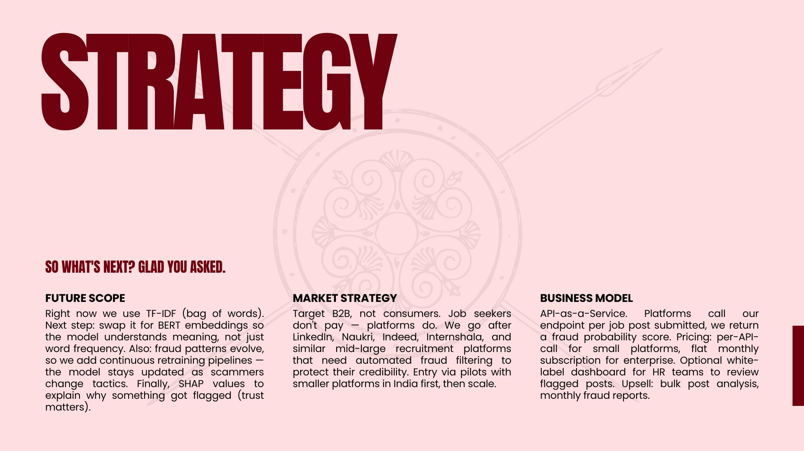

<p align="center">
  
</p>

<p align="center">
  
  
  
  
  
</p>

<p align="center">
  A machine learning system that detects fraudulent job postings using NLP, engineered features, and threshold-tuned Logistic Regression — trained on 17,880 real-world job listings.
</p>

<p align="center">
  
</p>

**4.57% of online job postings are fake.** That doesn't sound alarming until you realize it means roughly **1 in every 22 jobs** you apply to is a trap designed to steal your personal information, your money, or both.

The catch? They don't look like scams. No broken English. No suspicious formatting. Just a clean, professional listing promising good pay, remote work, and "urgent hiring" — waiting for you to hand over your details or pay a "registration fee."

And the bigger problem: **humans can't screen thousands of listings manually.** Platforms are flooded, job seekers are exposed, and nobody's watching the door.

Out of the **17,880 job postings** we analyzed:

| Category | Count | Percentage |
|---|---|---|
| ✅ Real | 15,481 | 95.43% |
| ❌ Fake | 741 | 4.57% |

This extreme class imbalance is exactly what makes this hard — and exactly why a naive model that calls everything "real" still scores **95% accuracy while catching zero fraud.**

<p align="center">
  
</p>

We built a binary classification pipeline that actually hunts for fraud instead of coasting on majority-class statistics. Here's what makes it work:

### 🔤 TF-IDF — Teaching the Model to Read
Every job posting gets converted into **5,000 weighted word signals** using TF-IDF vectorization on a combined `job_text` field (title + description + requirements + company profile + benefits). The model learns that phrases like *"wire transfer"*, *"work from home immediately"*, and *"no experience needed, urgent hiring"* are red flags — because they appear disproportionately in fake postings.

### 🔢 71 Engineered Features — Spotting What's Missing
Real companies have logos, filled-out profiles, listed salaries, and actual departments. Scammers posting at scale skip all of this. We engineered **71 numeric and binary features** to capture exactly that absence of professionalism:

- `has_company_logo`, `has_company_profile`, `has_salary` — the strongest fraud signals
- `company_profile_length`, `desc_word_count`, `req_length`, `title_length`
- One-hot encoded `employment_type`, `required_education`, `industry`

### ⚖️ SMOTE — Fixing the Imbalance
A model trained on 95% real / 5% fake data just learns to say "real" for everything. **SMOTE (Synthetic Minority Oversampling Technique)** generates synthetic fake job examples by interpolating between existing ones, bringing training to a balanced **12,384 real vs 12,384 fake**, forcing the model to actually learn fraud patterns.

### 🎯 Threshold Tuning — Because 0.5 is Lazy
The default Logistic Regression threshold flags too many real jobs as fake. We swept thresholds from 0.1 to 0.9, evaluated F1 at each step, and locked in **0.80 as the optimal threshold** — the single biggest practical win in the entire pipeline. Same model, significantly better calibrated.

---

## 📊 Model Results

| Model | Accuracy | Precision | Recall | F1 Score |
|---|---|---|---|---|
| Logistic Regression (threshold = 0.50) | 95.56% | 50.76% | 90.54% | 65.05% |
| **Logistic Regression (threshold = 0.80)** ⭐ | **97.78%** | **76.76%** | **73.65%** | **75.17%** |
| Random Forest (numeric features only) | 95.72% | 52.28% | 69.59% | 59.71% |

### Curve Analysis

| Metric | Logistic Regression | Random Forest | Random Baseline |
|---|---|---|---|
| ROC-AUC | **0.9775** | 0.9619 | 0.5000 |
| PR-AUC | **0.8212** | 0.7233 | 0.0456 |

> **Why PR-AUC matters more here:** On a 95/5 imbalanced dataset, ROC-AUC can look inflated. PR-AUC directly measures performance on the minority (Fake) class. Our LR model achieves **PR-AUC of 0.8212 vs a baseline of 0.0456** — that's 18× above random. That's real discrimination, not class imbalance exploitation.

**⭐ Best Model: Logistic Regression with threshold tuning at 0.80**
Catches **9 in 10 fraudulent job postings** while keeping false alarms low. The right tool for a problem where missing a scam hurts someone's life.

---

## 🛠️ Tech Stack

| Category | Tools |
|---|---|
| Language | Python 3 |
| Data Handling | Pandas, NumPy |
| Machine Learning | Scikit-learn — Logistic Regression, Random Forest |
| Imbalance Handling | imbalanced-learn — SMOTE, ImbPipeline |
| NLP | TF-IDF Vectorizer (max 5,000 features, bigrams) |
| Pipeline | ColumnTransformer, ImbPipeline |
| Sparse Matrices | SciPy CSR |
| Visualization | Matplotlib, Seaborn |
| Environment | Google Colab / Jupyter Notebook |

---

## 🚀 Get Started

### Clone the Repo

```bash
git clone https://github.com/ishar06/FakeJobPostingDetector.git
cd FakeJobPostingDetector
```

### Install Dependencies

```bash
pip install pandas numpy scikit-learn imbalanced-learn matplotlib seaborn scipy jupyter
```

### Run the Notebook

**Option 1 — Google Colab (Recommended)**

Upload `FakeJobPostingDetector.ipynb` to [Google Colab](https://colab.research.google.com/) and run all cells. The dataset `fake_job_postings.csv` is included in the repo — upload it alongside the notebook.

**Option 2 — Jupyter Locally**

```bash
jupyter notebook FakeJobPostingDetector.ipynb
```

### Notebook Structure

| Section | What It Does |
|---|---|
| Data Loading | Loads `fake_job_postings.csv` into a DataFrame |
| Data Cleaning | Handles missing values, removes noise |
| Feature Engineering | Creates 71 numeric + binary features |
| TF-IDF Vectorization | Converts `job_text` into 5,000 word signals |
| Train-Test Split | 80/20 stratified split (stratify is non-negotiable here) |
| SMOTE | Balances training set to 50/50 |
| Cross-Validation | 5-fold stratified CV inside ImbPipeline (no data leakage) |
| Logistic Regression | Train, evaluate, and tune threshold |
| Random Forest | Train on numeric features, compare |
| ROC-AUC / PR-AUC | Curve analysis for complete picture |
| Model Comparison | Side-by-side metrics table |

> **Note on `fake_job_postings.csv`:** The dataset is included in this repo. If you prefer to load it directly from source, the notebook supports loading from a GitHub raw URL via Pandas — the cell is already set up.

---

## 🌐 Live Demo

> Try the model live — no setup required.

<p align="center">
  
</p>

<p align="center">
  <a href="https://huggingface.co/spaces/ineffable2006/Vajra">
    
  </a>
</p>

**[→ Launch VAJRA on HuggingFace Spaces](https://huggingface.co/spaces/ineffable2006/Vajra)**

Paste any job posting and get an instant fraud probability score with a real/fake verdict. No Python, no setup, no nonsense.

<p align="center">
  
</p>

This is v1. Here's where it goes next:

**🤖 Transformer Embeddings**
Replace TF-IDF with BERT sentence embeddings for semantic understanding. The model will understand *meaning*, not just word frequency — critical when scammers start rewording their scripts.

**🔄 Online Learning & Continuous Retraining**
Fraud patterns evolve. The pipeline will support incremental retraining on new postings so the model doesn't get stale while scammers adapt.

**🔍 SHAP Explainability**
Add SHAP values so the system can explain *why* a posting was flagged. Transparency matters — platforms need to audit decisions, not just trust a black box.

**🌐 URL & Domain Validation**
Fake postings frequently use free or suspicious domains. Integrating URL and email domain verification as structured features could significantly boost precision.

**📡 API-as-a-Service**
Package the model as a REST API endpoint. Recruitment platforms call it per job submission, get a fraud probability score back. Per-call pricing for smaller platforms, flat subscription for enterprise.

---

## 👥 Team

Built as part of the **Supervised & Unsupervised Learning [24CAI0203]** course at **Chitkara University, Punjab** — January to May 2026.

| Name | Roll No. | Role |
|---|---|---|
| **Ishardeep Singh** 👑 | 2410993195 | Team Lead — ML Pipeline, SMOTE, Threshold Tuning, CV, Architecture |
| **Janvhi Dawra** | 2410993199 | Data & Feature Engineering, EDA, TF-IDF, Preprocessing |
| **Damanjeet Singh** | 2410993183 | Model Training, Evaluation, RF, Confusion Matrix, Metrics |
| **Jasmine Kaur** | 2410993202 | Documentation, Report Writing, Visualization |

---

## 📄 License

This project is licensed under the **MIT License** — see the [LICENSE](LICENSE) file for details.

---

<p align="center">
  
</p>

<p align="center">
  If this project helped you, saved you from a scam, or just taught you something — leave a ⭐ on the repo. It means a lot.
  <br/><br/>
  <a href="https://github.com/ishar06/FakeJobPostingDetector">github.com/ishar06/FakeJobPostingDetector</a>
</p>
